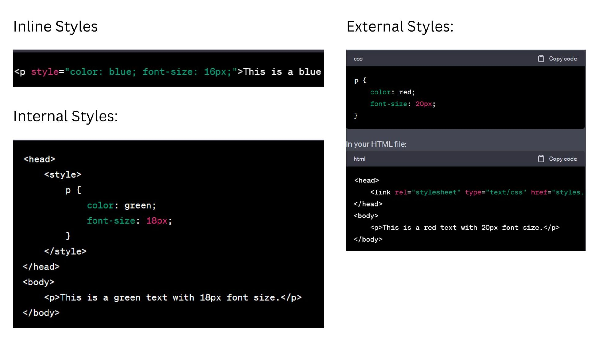
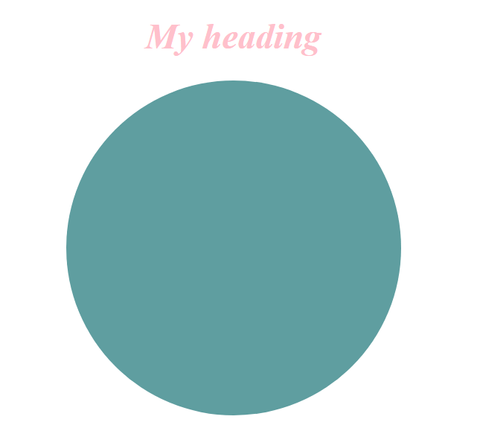
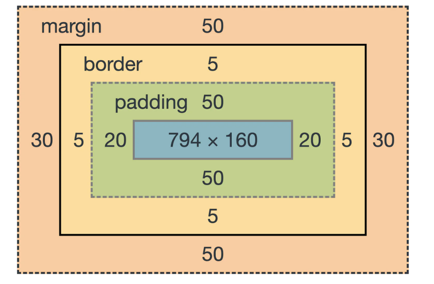
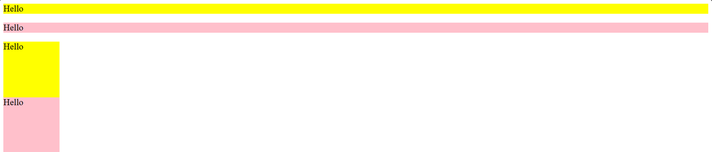
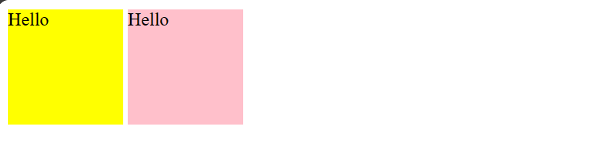
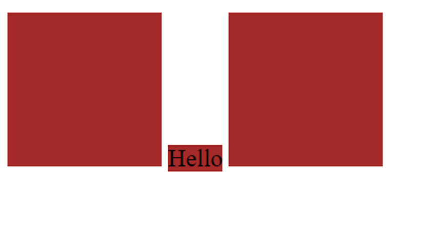

# Topics to be discussed
1. Introduction to CSS
2. Adding CSS to HTML
3. Styling a text
4. Creating shapes like circles and squares using div
5. Box Model - Padding, margin, border and content
6. Display property

# Introduction to CSS:

## Sample Lecture Link
https://experience-admin.masaischool.com/lectures/detail/?id=74308
- 

## Introduction

- CSS (Cascading Style Sheets) is a styling language used to control the presentation and layout of HTML documents on the web. 

## Detailed Explanation

- **What is the concept?** - 
CSS (Cascading Style Sheets) is a styling language used to control the presentation and layout of HTML documents on the web. It allows web developers to define the appearance of elements such as text, colors, fonts, spacing, and positioning. By separating the content (HTML) from its presentation (CSS), developers can create visually appealing and responsive websites. CSS works by selecting HTML elements and applying styles to them using rulesets defined in a stylesheet. These styles can be specified inline within HTML, embedded within a webpage, or linked externally to multiple web pages for consistent styling across a website.
3 ways of adding CSS to your HTML
 

- **Why is it useful?** - 
- **Real-world examples or analogies** - 
- **Visual models** - 

## Instructor Activity | Code Implementation | Examples

- 3 ways of adding colors to your text
```html
<h1 style="color: blue;">Title</h1> 
<h1 style="color: #fcde9f;">Title</h1>
<h1 style="color: rgb(252,222,159)">Title</h1>
```
In HTML we have tags such as 

```html
<i>Italic</i>
<u>Underline</u>
<b>Bold</b>
<strong>Bold</strong>
```


In CSS they can be written as:
```css
font-size: 30px;
font-weight: bold;
font-style: italic;
text-align: center;
text-decoration:line-through;
text-shadow: #fcde9f;
```


## Student Activities

 

## Conclusion

- CSS helps to improve the user experience by improving the aesthetics of your app.

## Resources - Official Documentation and Other Resources

- https://developer.mozilla.org/en-US/docs/Web/CSS


# Box Model

## Sample Lecture Link
https://experience-admin.masaischool.com/lectures/detail/?id=74308
- 

## Introduction

- The CSS Box Model is a fundamental concept in web design and development that describes how elements on a webpage are structured and spaced. It consists of four main components:

Content: The actual content of the HTML element, such as text, images, or other media.

Padding: The space between the content and the element's border. Padding helps create inner spacing within the element.

Border: A line that surrounds the content and padding of an element, demarcating its boundaries.

Margin: The space outside the border of the element, separating it from other elements on the webpage. Margins help control the spacing between elements.

## Detailed Explanation

- **What is the concept?** - 
The CSS Box Model is a fundamental concept in web design and development that describes how elements on a webpage are structured and spaced. It consists of four main components:

Content: The actual content of the HTML element, such as text, images, or other media.

Padding: The space between the content and the element's border. Padding helps create inner spacing within the element.

Border: A line that surrounds the content and padding of an element, demarcating its boundaries.

Margin: The space outside the border of the element, separating it from other elements on the webpage. Margins help control the spacing between elements.

- **Why is it useful?** - 
Layout Control: It provides developers with precise control over the layout and spacing of elements on a webpage. By adjusting properties like padding, border, and margin, developers can achieve the desired spacing and positioning of elements, ensuring a visually appealing and well-organized layout.

Responsive Design: The CSS Box Model is essential for creating responsive web designs that adapt to different screen sizes and devices. By adjusting padding, margin, and other properties based on media queries or viewport sizes, developers can ensure that elements are displayed optimally on various devices, from desktop computers to smartphones and tablets.

Whitespace Management: It helps manage whitespace effectively, allowing developers to control the spacing between elements and improve readability and visual hierarchy. Proper use of margins and padding can create breathing room between elements, making content easier to consume and navigate.

- **Real-world examples or analogies** - 
 

- **Visual models** - 
 

## Instructor Activity | Code Implementation | Examples

- Inspecting the Our investors and showing the 4 properties to students
https://www.masaischool.com/our-investors

## Student Activities

 

## Conclusion

- In conclusion, the CSS Box Model is a fundamental concept in web development that provides developers with precise control over the layout, spacing, and appearance of elements on a webpage. By understanding and utilizing the box model's properties such as padding, border, and margin, developers can create visually appealing, consistent, and responsive web designs that enhance user experience across different devices and browsers. 

## Resources - Official Documentation and Other Resources

- https://developer.mozilla.org/en-US/docs/Learn/CSS/Building_blocks/The_box_model


---
# Inline , inline-block and Block level elements (display property)

## Sample Lecture Link
https://experience-admin.masaischool.com/lectures/detail/?id=74308
- 

## Introduction

- The CSS Box Model is a fundamental concept in web design and development that describes how elements on a webpage are structured and spaced. It consists of four main components:

Content: The actual content of the HTML element, such as text, images, or other media.

Padding: The space between the content and the element's border. Padding helps create inner spacing within the element.

Border: A line that surrounds the content and padding of an element, demarcating its boundaries.

Margin: The space outside the border of the element, separating it from other elements on the webpage. Margins help control the spacing between elements.

## Detailed Explanation

- **What is the concept?** - 
 Block, Inline and Inline-block Elements

Inline elements do not start on a new line and only take up as much width as necessary. They typically flow within the content and do not create a new "block" of content.

- **`<span>`**
- **`<a>`** (anchor)
- **`<strong>`** and **`<em>`** (text emphasis)
- **``** (image)
- **`<br>`** (line break)
- **`<i>`** (italic)
- **`<b>`** (bold)
- **`<u>`** (underline)
- **`<small>`** (small text)
- **`<code>`** (code)

Block elements typically start on a new line and take up the full width available.

- **`<div>`**
- **`<p>`** (paragraph)
- **`<h1>`**, **`<h2>`**, ..., **`<h6>`** (headings)
- **`<ul>`**, **`<ol>`**, **`<li>`** (lists)
- **`<table>`**, **`<tr>`**, **`<th>`**, **`<td>`** (table elements)
- **`<form>`**, **`<input>`**, **`<button>`**, **`<textarea>`** (form elements)
- **`<blockquote>`** (block quotation)
- **`<hr>`** (horizontal rule)
- **`<header>`**, **`<footer>`**, **`<section>`**, **`<article>`**, **`<nav>`**, **`<aside>`** (HTML5 structural elements)

Inline block:
display: inline-block is a CSS property value pair that combines the characteristics of both display: inline and display: block. When applied to an element, it allows the element to:

1. Maintain Inline Behavior: Like inline elements, elements with display: inline-block will not start on a new line. They will flow within the content and respect surrounding elements.

2. Have Block-Like Properties: Unlike purely inline elements, display: inline-block elements can have width, height, padding, margin, and can be manipulated with box-model properties like padding and margin.


- **Why is it useful?** - 
Layout Control: It provides developers with precise control over the layout and spacing of elements on a webpage. By adjusting properties like padding, border, and margin, developers can achieve the desired spacing and positioning of elements, ensuring a visually appealing and well-organized layout.

Responsive Design: The CSS Box Model is essential for creating responsive web designs that adapt to different screen sizes and devices. By adjusting padding, margin, and other properties based on media queries or viewport sizes, developers can ensure that elements are displayed optimally on various devices, from desktop computers to smartphones and tablets.

Whitespace Management: It helps manage whitespace effectively, allowing developers to control the spacing between elements and improve readability and visual hierarchy. Proper use of margins and padding can create breathing room between elements, making content easier to consume and navigate.
- **Real-world examples or analogies** - 

- **Visual models** - 
<!-- Block-->
    <div style="background-color: yellow;">Hello</div>
    <p style="background-color: pink;">Hello</p>

    <div style="background-color: yellow; width: 100px; height: 100px;">Hello</div>
    <div style="background-color: pink; width: 100px; height: 100px;">Hello</div>
 

<!-- Inline -->
    <span style="background-color: yellow;">Hello</span>
    <span style="background-color: pink;">Hello</span>

    <span style="background-color: yellow; width: 100px; height: 100px;">Hello</span>
    <span style="background-color: pink; width: 100px; height: 100px;">Hello</span>
 

<!-- Inline-block -->
    <span style="display: inline-block; background-color: yellow; width: 100px; height: 100px;">Hello</span>
    <div style="display: inline-block; background-color: pink; width: 100px; height: 100px;">Hello</div>
 

## Instructor Activity | Code Implementation | Examples

- Explain the inline, block and inline-block elements here
https://www.masaischool.com/our-investors

## Student Activities

- Create below layout
 

## Conclusion

- Inline elements flow within the text and do not force new lines. They are typically used for elements that should appear inline with text, like links (<a>) or spans (<span>).
-Block elements start on a new line and take up the full width available. They are commonly used for structural elements like paragraphs (<p>) or headings (<h1> - <h6>).
-Inline-block elements combine features of both inline and block elements. They flow within text like inline elements but can have width, height, padding, and margin like block elements. This makes them versatile for creating grid-like structures or aligning elements horizontally while retaining block-like properties.

## Resources - Official Documentation and Other Resources

- https://developer.mozilla.org/en-US/docs/Web/CSS/display


---

# Box sizing:

## Sample Lecture Link

- https://experience-admin.masaischool.com/lectures/detail/?id=74314

## Introduction

- The box-sizing property in CSS determines how the width and height of an element are calculated. 

## Detailed Explanation

- **What is the concept?** - 
Box sizing is a CSS property that determines how the width and height of an element are calculated. By default, in the CSS box model, the width and height of an element are calculated by adding the width/height values specified in CSS to the element's padding, border, and margin. This means that if you set a width of 200 pixels to an element with padding of 20 pixels and a border of 2 pixels, the actual width of the element will be 224 pixels (200px + 20px padding on the left + 20px padding on the right + 2px border on the left + 2px border on the right).

The box-sizing property allows developers to change this behavior. The two main values for box-sizing are:

content-box: This is the default value. It includes only the content of the element when calculating its width and height. Padding, border, and margin are added to the specified width and height.

border-box: With this value, the width and height of the element include the content, padding, and border, but not the margin. This means that if you set a width of 200 pixels to an element with padding of 20 pixels and a border of 2 pixels, the element will be exactly 200 pixels wide, as padding and border are included within the specified width.
- **Why is it useful?** - 
Understanding and using the box-sizing property is crucial for maintaining consistent and predictable layouts in web development. It helps developers avoid unexpected behavior when adding padding and borders to elements, especially in responsive design where elements need to adapt to different screen sizes and devices. Additionally, box-sizing can simplify layout calculations and make CSS code more manageable and maintainable. 
- **Real-world examples or analogies** - 
Add padding to a div and explain calculating the total height, width after and before applying box-sizing:border-box
- **Visual models** - 
 

## Instructor Activity | Code Implementation | Examples

 
 
 
 

## Student Activities

- Create a div inside another with a padding of 20px. Use box sizing property and make sure the height and width of parent do not change.

## Conclusion

- In conclusion, the box-sizing property in CSS is a fundamental concept that plays a crucial role in web development. By determining how the width and height of an element are calculated, it helps developers create consistent and predictable layouts. With values like content-box and border-box, developers can control whether padding and border affect the specified dimensions of an element. Understanding and properly using box-sizing is essential for building responsive and well-structured websites, making it an indispensable tool in the toolbox of any web developer.

## Resources - Official Documentation and Other Resources

- https://developer.mozilla.org/en-US/docs/Web/CSS/box-sizing


# Useful extensions and pages
Google fonts and icons: https://fonts.google.com/ 
Box shadow: https://getcssscan.com/css-box-shadow-examples
Color picker : https://chromewebstore.google.com/detail/eye-dropper/hmdcmlfkchdmnmnmheododdhjedfccka


# Interview questions

1. What is Box Model?
2. Difference between inline, block and inline-block elements.
3. Units of measurements in CSS.

---

# CSS Linters 

## Stylelint

https://stylelint.io/

Linters are tools that check your code against predefined rules to make sure the code is consistent and without errors linters are great for everyone who writes code and they're especially useful if you work on a team or you publish your code to a platform like github because they enable you to enforce strict rules for code and formatting so that your code remains consistent regardless of who is working.

```bash
# generate package.json
npm init -y
```

https://stylelint.io/user-guide/get-started

```bash
npm init stylelint
```

Create your CSS files.
```bash
# Run Stylelint on all the CSS files in your project:
npx stylelint "**/*.css"
```

Install stylelint extension on vs code.

## Prettier

https://prettier.io/

https://prettier.io/docs/en/install

Install the package below because the prettier standard configuration conflicts with some of the styling configurations and this particular configuration will override any styling configurations that conflict with prettier and therefore everything will work properly.

https://github.com/prettier/stylelint-config-prettier

```bash
npm install --save-dev stylelint-config-prettier
```

Update your .stylelintrc.json with below code
```bash
{
"extends":[
"stylelint-config-standard",
"stylelint-config-prettier"
]
}
```

Install Prettier extension on VS code.

We need to set a configuration change for vs code itself. Go to preferences and settings.


Go to workspace and then search for formatter here you'll find the option editor default formatter and you want to use the drop down to find prettier code formatter here.
 
 

Then you can choose how you want to apply formatting and set this to format on save so that every time you save something the formatter kicks in and cleans up the code.
