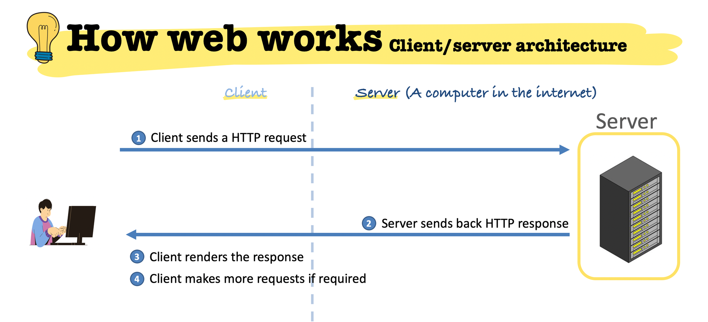
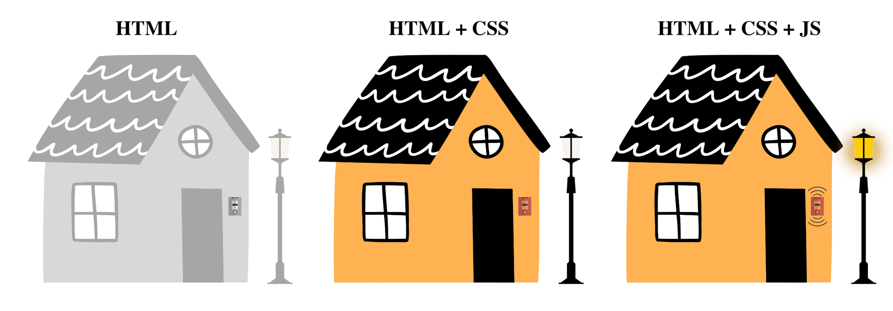

# Topics to be discussed
1. Backend and frontend
2. What is HTML, CSS and JS
3. Tags and elements
4. Attributes
5. Markup vs programming language
6. Different tags in HTML
7. Inline and block elements

# Backend vs Frontend

## Sample Lecture Link

[Lecture Link](https://experience-admin.masaischool.com/lectures/detail/?id=74163)

## Introduction

## Frontend:

The frontend is what users directly interact with on a website. It includes HTML for content, CSS for styling, and JavaScript for interactivity.

## Backend:
The backend is the server-side of a website. It handles tasks like processing requests, interacting with databases, and implementing logic. Technologies include languages like Python and frameworks like Django. Security, performance, and scalability are key considerations.


## Detailed Explanation

### Frontend:

The frontend is the part of a web application or website that users interact with directly.
It consists of everything that users see and interact with in their web browsers.
Technologies commonly used in frontend development include HTML, CSS, and JavaScript.
HTML (Hypertext Markup Language) defines the structure and content of web pages.
CSS (Cascading Style Sheets) is used to style the HTML elements, controlling their layout, colors, fonts, and overall appearance.
JavaScript is a programming language used to add interactivity and dynamic behavior to web pages, such as form validation, animations, and handling user input.
Frontend developers focus on creating a visually appealing and user-friendly interface that delivers a smooth and intuitive user experience.

### Backend:

The backend refers to the server-side of a web application or website that users don't directly interact with.
It handles tasks such as processing requests from the frontend, interacting with databases, and performing computations or business logic.
Technologies commonly used in backend development include programming languages like Python, Ruby, Java, PHP, and frameworks like Django, Ruby on Rails, Spring Boot, and Laravel.

Backend developers design and implement the server-side logic of the application, including handling authentication, managing user data, and generating dynamic content.
The backend communicates with the frontend by sending and receiving data through APIs (Application Programming Interfaces), typically in formats like JSON (JavaScript Object Notation) or XML (eXtensible Markup Language).

### The process:

### The client requests a service

- we open a browser (client)
- we hit a url for example: [www.google.com](http://www.google.com) (Uniform Resource Location)
    - the client sends a message to the server asks for a resource
    - Resources can be - web pages, images, video files, fonts, stylesheets
    - This message is formatted based on a protocol called `HTTP`
    - In other words, HTTP (Hypertext transfer protocol) is a standard structure (or protocol) that clients and servers use to communicate over internet.
    - With an `HTTP request`, the client communicates to the server, what it is looking for.

### The server provides the service

- The server listens to the message
- It figures out what the client is asking
- It sends a message back to the client
- This message is called an `HTTP response`

The client gets back a message

- **Real-world examples or analogies** - 
 BE example:

- https://jsonplaceholder.typicode.com/
- BE App returns something similar to this: https://jsonplaceholder.typicode.com/photos?_start=0&_limit=5

 FE example:


```html
<div id="app">
  <h1>Posts Extrated from Json Placeholder API</h1>
</div>
```

```css
*{
  box-sizing:border-box;
}

body {
  padding: 2em;
  background-color: hsl(hue(#1f2933),30,95);
  font: normal 100%/1.5 helvetica, arial, sans-serif ;
}

h1{
  margin-bottom:50px;
  font-weight:400;
}

img {
  width: 100%;
  border-radius: 50%;
}

#app{
  padding: 50px;
  max-width: 1350px;
  margin: 0 auto;
}

.card{
  background-color: gold;
  box-shadow: 0px 20px 30px -10px rgba(0 ,0,0, .3);
  border-radius: 8px;
  padding: 30px;
  display:inline-block;
  width: 32%;
  margin-right: 1.3%;
  margin-bottom: 30px;
  vertical-align: middle;
  transition: .2s all;
}
.card:hover{
  transform:scale(1.03);  
}
h2{
  font-weight: 400;
  margin-bottom:30px;
  color: dodgerblue;
}

p{
  font-weight: 300;
  line-height: 1.5em;
  letter-spacing: .3px;
}
```

```js
var app = document.getElementById('app');


fetch('https://jsonplaceholder.typicode.com/photos?_start=0&_limit=5')
  .then((response) => response.json())
  .then((posts) => {
  posts.forEach(function(post, i){
    displayPost(post)
  })
});


function displayPost(post){
  
  // create a HTML "div" Element and add Card class to it
  var card = document.createElement('div');
  card.classList.add('card');
  
  // Create h2 tag and set it's text content to the post's title
  var title = document.createElement('h2');
  title.textContent = post.title.substring(0, 10);
  
  // create p tag and set it's text content to the post's body;
  var body = document.createElement('p');
  body.textContent = post.title.substring(0, 40).concat('...');
  
  // create img
  var img = document.createElement('img');
  img.src = post.thumbnailUrl;
  
  // append the title and body to card
  card.append(title);
  card.append(img);
  card.append(body);
  
  // Display the card by appending it to our app element
  app.append(card);
  
}

```


- **Visual models** - 



## Student Activities

- Visit: https://www.amazon.in/Apple-iPhone-15-Plus-256/dp/B0CHWV3L2R/ref=sr_1_10?crid=3IYIGCZNHLQ98
- Inspect and change the price

## Conclusion
In summary, frontend and backend development are both integral parts of web development, each serving distinct roles in creating functional and user-friendly websites and applications. While frontend development focuses on the visual presentation and user interaction, backend development handles server-side logic, data processing, and integration with databases and external services. Together, frontend and backend technologies work in harmony to deliver seamless and dynamic web experiences to users, ensuring the success and efficiency of modern digital products.


---

# Introduction to HTML 

## Introduction

- HTML, which stands for HyperText Markup Language, is the standard markup language used to create and design web pages. It provides the structure for web documents by using a system of tags and attributes to define elements such as headings, paragraphs, images, links, and more.

In the context of this course, HTML serves as a foundational language for web development. Understanding HTML is crucial as it forms the backbone of every web page. It lays the groundwork upon which other web technologies like CSS (Cascading Style Sheets) for styling and JavaScript for interactivity are built upon.

## Detailed Explanation

- **What is the concept?** - 

HTML is a markup language used to create the structure and content of web pages. It consists of a set of tags and attributes that define the elements within a document, such as headings, paragraphs, links, images, forms, and more. HTML documents are interpreted by web browsers, which render the content according to the instructions provided in the HTML code.

- **Why is it useful?** -

**Structure**: HTML provides a structured way to organize content on web pages. It defines the elements and layout of a webpage, making it easier for both developers and browsers to understand how content should be displayed.

**Compatibility**: HTML is supported by all web browsers, making it a universal language for creating web pages. This ensures that websites built with HTML can be accessed and viewed by users across different devices and platforms.

**Integration**: HTML can be easily integrated with other technologies such as CSS (Cascading Style Sheets) for styling and JavaScript for interactivity. This allows developers to create dynamic and visually appealing web experiences.

**SEO (Search Engine Optimization)**: HTML plays a crucial role in SEO by providing search engines with structured information about the content of a webpage. Proper use of HTML elements such as headings, meta tags, and alt attributes can help improve a website's visibility and ranking in search engine results.

**Accessibility**: HTML allows developers to create accessible web content by providing semantic elements for defining headings, paragraphs, lists, links, and more. This helps improve the usability and inclusivity of websites for people with disabilities.

- **Real-world examples or analogies** - 
Inspect and show HTML code for website: https://in.sugarcosmetics.com/

- **Visual models** - 


Think of building a house as akin to creating a webpage. The fundamental architecture—the pillars that hold up the structure, the walls that divide rooms, and the roof that covers everything—is akin to HTML. These elements set the "bones" of the house, delineating spaces for living, sleeping, cooking, etc., just as HTML tags define where text, images, and links go on a web page.

Once the house is built, you're not going to leave it bare, right? That's where interior and exterior design come into play. The paint on the walls, the color scheme of the rooms, the curtains on the windows, and the decoration pieces on the coffee table—all these stylistic choices are like CSS. They add aesthetic flair and functionality to the basic structure, transforming it from a mere construction of brick and mortar into a cozy, visually appealing home.

Now think of JavaScript as the electricity that powers the lights, appliances, and heating or cooling systems, as well as the doorbell that rings when someone is at your front door. The electricity adds a functional layer to the house, allowing you to live comfortably and do tasks more easily. Similarly, the doorbell adds an interactive feature; when someone pushes the button, you're alerted to a visitor at your door. In the digital realm, JavaScript enables dynamic, interactive features like alert boxes, real-time updates, and more on a website.


## Student Activities

Use documentation for img and video tag and add them to your App.


## Resources - Official Documentation and Other Resources

- https://developer.mozilla.org/en-US/docs/Web/HTML
- https://developer.mozilla.org/en-US/docs/Learn/HTML/Introduction_to_HTML/Getting_started

---

# Markup Language VS Programming Language:

## Introduction

- HTML stands for HyperText Markup Language, a markup language used to create web pages. Unlike programming languages, HTML describes the structure and presentation of digital documents. It allows developers to mark up content like text, images, and links, which can be styled with CSS. JavaScript can then be used for interactivity. While not a programming language, HTML is essential for web development, providing the foundation for creating web pages.

## Detailed Explanation

- **What is the concept?** 
HTML stands for HyperText Markup Language, and it is often referred to as a markup language. While some may argue that HTML is a programming language, it is more accurately a markup language, which is a type of language that is used to describe the structure and presentation of digital documents.

A programming language, on the other hand, is a language that is used to write code that can be executed by a computer. HTML cannot be used to write code that can be executed by a computer, but it is used to describe the structure of a web page.

HTML is used to create the building blocks of a website, such as text, images, and links. It allows web developers to mark up the content of a web page, which can then be styled and presented using CSS. JavaScript is then used to add interactivity and dynamic functionality to the web page.

In summary, HTML is a markup language that is used to describe the structure and content of a web page, but it is not a programming language in the traditional sense.HTML is a markup language used to create web pages. It is not a programming language, but rather a language used to describe the structure and presentation of digital documents. While HTML cannot be used to write code that is executed by a computer, it enables web developers to mark up the content of a web page, which can then be styled and presented using CSS.

Furthermore, HTML is used to create the building blocks of a website, such as text, images, and links. This provides the foundation for a web page, which can then be enhanced with JavaScript to add interactivity and dynamic functionality.

In conclusion, while HTML is not a programming language, it is a crucial component of web development and is used to create the structure and content of a web page.


## Resources - Official Documentation and Other Resources

- https://developer.mozilla.org/en-US/docs/Glossary/Markup

---
# Different Tags in HTML 

| Tag | Description | Usecase |
| --- | --- | --- |
| p | Paragraph | Structure main content |
| h1-h6 | Headings (levels 1-6) | Page and section titles |
| br | Line Break | Create new lines within text |
| hr | Horizontal Rule | Separate content visually |
| mark | Highlight | Highlight parts of text |
| cite | Citation | Reference a title of a work |
| dfn | Definition | Define a term |
| bdi | Bi-directional Isolation | Text with a different direction |
| bdo | Bi-directional Override | Reverse text direction |
| samp | Sample Output | Show sample system output |
| kbd | Keyboard Input | Indicate keyboard input |
| var | Variable | Name a variable in math/programming |
| i | Italic | Emphasize text |
| b | Bold | Emphasize text strongly |
| small | Small Print | Display side comments/legalese |
| del | Deleted Text | Indicate deleted text |
| ins | Inserted Text | Indicate added text |
| sub | Subscript | Display text below the line |
| sup | Superscript | Display text above the line |
| ol | Ordered List | List items in numbered format |
| ul | Unordered List | List items in bulleted format |
| dl | Definition List | List terms with definitions |

### Formatting Text:

### 1. Paragraphs (`<p>`)

- **Usage**: Represents a paragraph of text.
- **Example**: Think of `<p>` like the paragraphs in a novel. Each time a character speaks or a new idea begins, there's often a new paragraph.
    
    ```html
    <p>This is a paragraph of text.</p>
    
    ```
    

### 2. Headings (`<h1>` to `<h6>`)

- **Usage**: Represents 6 levels of headings, with `<h1>` being the highest and most important.
- **Example**: Think of headings like the titles and subtitles in a textbook. The main title (e.g., "Biology") might be an `<h1>`, while chapter titles could be `<h2>`, and sub-chapters `<h3>`.
    
    ```html
    <h1>Main Title</h1>
    <h2>Sub-title or Chapter Title</h2>
    
    ```
    

### 3. Line Breaks (`<br>`)

- **Usage**: Inserts a line break.
- **Example**: It's like pressing the "Enter" key once in a word processor.
    
    ```html
    First line.<br>Second line.
    
    ```
    

### 4. Horizontal Rules (`<hr>`)

- **Usage**: Produces a horizontal line, often used as a thematic break.
- **Example**: In novels, when there's a scene change within a chapter, there might be a small line or decorative element. That's like `<hr>`.
    
    ```html
    <hr>
    
    ```
    

---

### Text Formatting Tags:

### 5. Mark (`<mark>`)

- **Usage**: Represents text that has been marked or highlighted.
- **Analogy**: It's like using a highlighter on a physical document.
- 
### 6. Cite (`<cite>`)

- **Usage**: Indicates the title of a creative work (book, film, etc.).
- **Example**:
    
    ```html
    My favorite book is <cite>The Compound Effect</cite> by Darren Hardy.
    ```
    
    ```jsx
    <p>More information can be found in <cite>[ISO-0000]</cite>.</p>
    ```
    
- Documentation: [MDN](https://developer.mozilla.org/en-US/docs/Web/HTML/Element/cite)
- **Description**
    
    The `<cite>` element in HTML is used to reference the **title** of a creative work. This can be a book, a play, a movie, a painting, a sculpture, a song, or any other work that has a distinct title. 
    
    Here are some things to know about the `<cite>` element:
    
    1. **Purpose**: The main purpose of the `<cite>` tag is to provide a way to indicate the source or reference for a quotation or a claim made in the content.
    2. **Display**: By default, browsers usually render `<cite>` content in italics.
    3. **Attributes**: Like many HTML tags, the `<cite>` tag can have global attributes, but it doesn't have any specific attributes of its own.
    4. **Example of usage**:
        
        ```html
        <p>In <cite>The Catcher in the Rye</cite>, J.D. Salinger explores themes of identity, isolation, and connection.</p>
        
        ```
        
    5. **Not for URLs or authors**: The `<cite>` tag should be used to reference the **title** of works, not the authors of those works or the URLs where the works might be found. If you want to link to a source, you should use the `<a>` tag. If you want to mark up the author's name, a plain `<span>` or other contextual elements like `<p>` or `<address>` might be more appropriate.
    6. **Styling and customization**: You can style the `<cite>` element with CSS just like any other HTML element. For instance, if you wanted to override the default italics:
        
        ```css
        cite {
            font-style: normal;
        }
        
        ```
        
    7. **Semantic importance**: Using semantic elements like `<cite>` in your HTML helps make your content more understandable for search engines, assistive technologies (like screen readers for the visually impaired), and other machines or tools that parse web content. This can aid in accessibility and SEO (search engine optimization).
    8. **Parent and Child elements**: The `<cite>` element can be used as a child of any element that accepts phrasing content. This includes elements like `<p>`, `<div>`, `<article>`, and many more.
    9. **Compatibility**: The `<cite>` element is widely supported in all modern web browsers.
    
    It's always a good practice to use semantic tags like `<cite>` appropriately to convey the meaning and structure of your content accurately.
    

### 7. Dfn (`<dfn>`)

- **Usage**: Represents the defining instance of a term.
- **Example**:
    
    ```html
    A <dfn>computer</dfn> is a device that can be instructed to carry out sequences of arithmetic or logical operations automatically.
    
    ```
    
- Documentation: [MDN](https://developer.mozilla.org/en-US/docs/Web/HTML/Element/dfn)
- **Description**
The `<dfn>` element in HTML stands for "definition" and is used to indicate the defining instance of a term. Here are some key details about the `<dfn>` element:

1. **Purpose**: The `<dfn>` tag is used to highlight the introduction or first instance of a term in a context where it will be defined.
2. **Display**: By default, most browsers render the `<dfn>` content in italics.
3. **Attributes**:
    - **Global Attributes**: Like most HTML elements, `<dfn>` supports global attributes.
    - **`title` Attribute**: This attribute is commonly used with `<dfn>` to provide a brief definition of the term.
4. **Example of usage**:
    
    ```html
    <p>The <dfn title="A mythical creature often depicted as a large, scaly, fire-breathing serpent.">dragon</dfn> is a common figure in medieval folklore.</p>
    
    ```
    
5. **Use with `<abbr>`**: If the defining instance of a term is also an abbreviation, you can nest the `<abbr>` element inside the `<dfn>` element.
    
    ```html
    <p>The <dfn title="Hypertext Markup Language"><abbr title="Hypertext Markup Language">HTML</abbr></dfn> is the standard markup language for documents designed to be displayed in a web browser.</p>
    
    ```
    
6. **Styling and customization**: You can style the `<dfn>` element with CSS like any other HTML element. For instance, if you want to override the default italics:
    
    ```css
    dfn {
        font-style: normal;
    }
    
    ```
    
7. **Semantic importance**: Using semantic elements like `<dfn>` helps convey the meaning and structure of your content more clearly. This can benefit search engines, assistive technologies (like screen readers for the visually impaired), and other tools that parse and interpret web content.
8. **Parent and Child elements**: The `<dfn>` element can be used as a child of any element that accepts phrasing content, such as `<p>`, `<div>`, `<article>`, and so on.


---

## Working with lists

### 1. Ordered List (`<ol>`)

- **Usage**: Represents a list of items in which order does matter.
- **Example**:
    
    ```html
    <ol>
      <li>Wake up</li>
      <li>Brush teeth</li>
      <li>Have breakfast</li>
    </ol>
    
    ```
    
- Description
    
    Let's delve into the `<ol>` element in HTML.
    
    ### `<ol>`: The Ordered List Element
    
    The `<ol>` tag in HTML stands for "ordered list." As the name suggests, it is used to represent a list of items in a specific order. Each item in the list is wrapped with a `<li>` (list item) tag. The items in an ordered list are usually displayed with a number or letter preceding them, indicating their sequence.
    
    ### Why Use It?
    
    An ordered list is essential in situations where the sequence of the items matters, unlike an unordered list (`<ul>`), where the sequence is irrelevant. You'd typically use `<ol>` in contexts like step-by-step instructions, rankings, or any other scenario where the order is crucial.
    
    ### Real Example: Baking a Cake
    
    Let's say you're writing a recipe for baking a chocolate cake, and you want to provide step-by-step instructions. The order of the steps is critical; otherwise, you might end up with a culinary disaster!
    
    ```html
    <ol>
        <li>Preheat your oven to 350°F (175°C).</li>
        <li>In a large bowl, mix flour, cocoa powder, baking powder, and salt.</li>
        <li>In another bowl, beat together butter and sugar until light and fluffy.</li>
        <li>Add eggs one by one to the butter and sugar mixture, beating well after each addition.</li>
        <li>Gradually blend in the dry ingredients until fully combined.</li>
        <li>Pour the batter into a greased baking pan.</li>
        <li>Bake for 30-35 minutes or until a toothpick inserted into the center comes out clean.</li>
        <li>Allow the cake to cool in the pan for 10 minutes, then transfer to a wire rack to cool completely.</li>
    </ol>
    
    ```
    
    In this recipe, the order of the instructions is essential. For instance, you can't start by adding eggs if you haven't first combined your dry ingredients. The `<ol>` element ensures readers understand the sequence and follow the steps correctly.
    
    ### Additional Attributes:
    
    The `<ol>` tag can also use several attributes to adjust the type of markers or start the list from a different number:
    
    - `type`: Specifies the type of marker (like "1", "A", "a", "I", "i").
    - `start`: Specifies the starting number for the list.
    
    For instance, if you wanted your list to start from step 3 using Roman numerals:
    
    ```html
    <ol type="I" start="3">
        <li>Third step</li>
        <li>Fourth step</li>
    </ol>
    
    ```
    
    ### In Summary:
    
    The `<ol>` tag in HTML is a vital tool when representing ordered sequences or steps. Its primary function is to communicate the importance of order in the given context, ensuring that the audience understands the sequence in which the actions or items should be acknowledged or executed. Whether it's in recipes, instructional manuals, or rankings, `<ol>` plays a crucial role in presenting information clearly and effectively.
    

### 2. Unordered List (`<ul>`)

- **Usage**: Represents a list of items in which order doesn't matter.
- **Example**:
    
    ```html
    <ul>
      <li>Milk</li>
      <li>Eggs</li>
      <li>Bread</li>
    </ul>
    
    ```
    
- Description
    
    Let's explore the `<ul>` element in HTML.
    
    ### `<ul>`: The Unordered List Element
    
    The `<ul>` tag in HTML stands for "unordered list." It is used to represent a list of items where the order is not essential. Each item within the list is enclosed with a `<li>` (list item) tag. Typically, items in an unordered list are displayed with bullet points to indicate individual list entries.
    
    ### Why Use It?
    
    You would use the `<ul>` element in situations where you want to list items, but their sequence isn't crucial. Unlike the ordered list (`<ol>`), where the order matters, the `<ul>` is perfect for displaying collections of items without implying any particular sequence or hierarchy.
    
    ### Real Example: Grocery Shopping List
    
    Imagine you're jotting down a quick grocery shopping list. For most people, the order in which the items are written doesn't necessarily dictate the order in which they must be picked up. Here's how such a list might look in HTML:
    
    ```html
    <ul>
        <li>Milk</li>
        <li>Bread</li>
        <li>Eggs</li>
        <li>Tomatoes</li>
        <li>Orange juice</li>
    </ul>
    
    ```
    
    In this grocery list, it doesn't matter if you pick up eggs before bread or tomatoes before milk. The main point is to remember to buy all these items. The `<ul>` element is perfect for representing such lists.
    
    ### Appearance:
    
    By default:
    
    - The `<ul>` element displays its items with bullet points in most web browsers.
    - Items are usually presented with a vertical stack layout, with each item appearing below the previous one.
    
    However, the default appearance of the `<ul>` can be customized using CSS, allowing you to change the bullet point style, layout, and other visual properties.
    
    ### Nested Lists:
    
    Unordered lists can be nested within each other to represent sub-items or sub-categories. Here's an example of a nested list, perhaps for categorizing groceries:
    
    ```html
    <ul>
        <li>Dairy
            <ul>
                <li>Milk</li>
                <li>Butter</li>
            </ul>
        </li>
        <li>Bakery
            <ul>
                <li>Bread</li>
                <li>Pastries</li>
            </ul>
        </li>
    </ul>
    
    ```
    
    In this nested list, "Dairy" and "Bakery" are top-level items, and beneath each, we have a sub-list specifying related grocery items.
    
    ### In Summary:
    
    The `<ul>` tag in HTML is invaluable when you need to represent a collection of items without a specific order. Be it a simple list of tasks, categories on a website, or features of a product, the unordered list provides a structured yet flexible way to display information. It's a staple in web content creation, ensuring that various types of lists are presented clearly and effectively to users.
    

### 3. Definition List (`<dl>`)

- **Usage**: Represents a list of terms followed by one or more descriptions.
- **Example**:
    
    ```html
    <dl>
      <dt>HTML</dt>
      <dd>HyperText Markup Language</dd>
      <dt>CSS</dt>
      <dd>Cascading Style Sheets</dd>
    </dl>
    
    ```
    
---
## Working with links

In the vast world of the internet, imagine every website as an island. These islands are unique, rich with content, and offer different experiences. But what if these islands were isolated? How would you travel between them? This is where the HTML `<a>` tag, commonly known as the anchor element, comes into play. Think of it as the bridge that connects these islands.

### 1. Basics of the Anchor Element:

The `<a>` tag is used to create links, allowing users to navigate from one page to another, be it within the same website or to a completely different one.

```html
<a href="<https://www.example.com/>">Visit Example</a>

```

In this, "Visit Example" is the visible text and the `href` attribute is the destination address, much like a bridge's starting point and its destination.

### 2. Understanding URLs:

**a) Absolute URL**:
It's a full web address. If you think of it as an address, it's similar to giving someone your full home address including your city, state, and country.

```html
<a href="<https://www.example.com/gallery>">Go to Gallery</a>

```

**b) Relative URLs**:
These are partial addresses that are relative to the current page. Imagine giving someone directions to your kitchen, while they're already in your living room.

- **Folder Down** (Navigating deeper into the site's structure):
    
    ```html
    <a href="images/pic.jpg">See the picture</a>
    
    ```
    
- **Folder Up** (Going back in the site's structure):
    
    ```html
    <a href="../about.html">About Us</a>
    
    ```
    

### 3. More Than Just Web Pages:

Links can point to various resources:

- Images: `<a href="images/sunset.jpg">View Sunset Image</a>`
- PDFs: `<a href="files/report.pdf">Download Report</a>`

You can even prompt a user to download a resource directly:

```html
<a href="images/sunset.jpg" download>Click to download the sunset image</a>

```

### 4. Navigating Within a Page:

**a) Fragments**: Let's say a webpage is a multi-story building. If you want to guide someone to a specific floor or room, you'd use fragments.

```html
<h2 id="summary">Summary</h2>
...
<a href="#summary">Jump to Summary</a>

```

**b) Jump to Top Link**: If you're at the base of this building and want a quick elevator to the top, you'd use:

```html
<a href="#">Back to Top</a>

```

### 5. Difference Between Link and Hyperlink:

All hyperlinks are links, but not all links are hyperlinks. Confused? Think of fruits. All apples are fruits, but not all fruits are apples.

A "link" is a more general term that can refer to anything that connects two things. In the web context, it often means a URL or an address. A "hyperlink," on the other hand, is interactive and clickable, usually taking you from one web page to another. In HTML, hyperlinks are created using the `<a>` tag.

### 6. Extra Tips for Enhancing User Experience:

- **Opening Links in a New Tab**: To let users keep your page open while visiting another site:
    
    ```html
    <a href="<https://www.example.com/>" target="_blank">Open Example in a new tab</a>
    
    ```
    
- **Mailto Links**: Want your users to send you an email directly by clicking a link? Here you go:
    
    ```html
    <a href="mailto:example@example.com">Send us an email</a>
    
    ```
    
- **Title Attribute**: Provide a brief tooltip description when hovering over the link:
    
    ```html
    <a href="<https://www.example.com/>" title="Go to Example's homepage">Example</a>
    
    ```
    

## The `target` attribute

The `target` attribute of the `<a>` (anchor) tag in HTML specifies where a new page will be displayed when the link is clicked. This is especially important when you're working with hyperlinks that lead to external websites, documents, or when working with frames and iframes.

Here are the possible values for the `target` attribute:

1. **`_blank`**: Opens the linked document in a new window or tab. This is commonly used for external links to ensure that the user doesn't navigate away from the current page.
    
    ```html
    <a href="<https://www.example.com>" target="_blank">Visit Example</a>
    
    ```
    
2. **`_self`**: Opens the linked document in the same frame or window. This is the default behavior if no target attribute is specified.
    
    ```html
    <a href="page2.html" target="_self">Go to Page 2</a>
    
    ```
    
3. **`_parent`**: Opens the linked document in the parent frame (used in the context of frames or iframes). If there's no parent frame, this behaves the same as `_self`.
    
    ```html
    <a href="page3.html" target="_parent">Go to Page 3 in parent frame</a>
    
    ```
    
4. **`_top`**: Opens the linked document in the full body of the current window, essentially breaking out of any frame. This can be handy if your site is being embedded elsewhere and you want a link to break out of the embed.
    
    ```html
    <a href="page4.html" target="_top">Go to Page 4, breaking out of any frames</a>
    
    ```
    
5. **framename**: If you're using frames (which are less common in modern web design), you can also specify the name of the frame you want the link to open in. This requires the target frame to have a `name` attribute set.
    
    ```html
    <!-- Frame Definition -->
    <frameset cols="50%,50%">
        <frame src="page1.html" name="leftFrame">
        <frame src="page2.html" name="rightFrame">
    </frameset>
    
    <!-- Inside page1.html -->
    <a href="page3.html" target="rightFrame">Load Page 3 in the right frame</a>
    
    ```
    

**Important Note**: Using `target="_blank"` without additional security precautions can expose your site to vulnerabilities (like reverse tabnabbing). To mitigate this, it's good practice to add the `rel="noopener noreferrer"` attribute to such links:

```html
<a href="<https://www.example.com>" target="_blank" rel="noopener noreferrer">Visit Example</a>

```

This ensures that the new page cannot access your page via the `window.opener` object, potentially protecting your users from phishing attacks.

---


# Important interview questions.
1. What are inline and block level elements.
2. What are meta tags? Give examples.
3. What are semantic tags? Give examples.
4. What are HTML attributes?